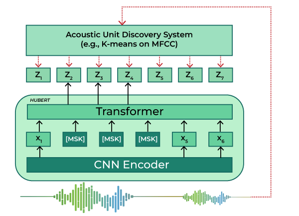
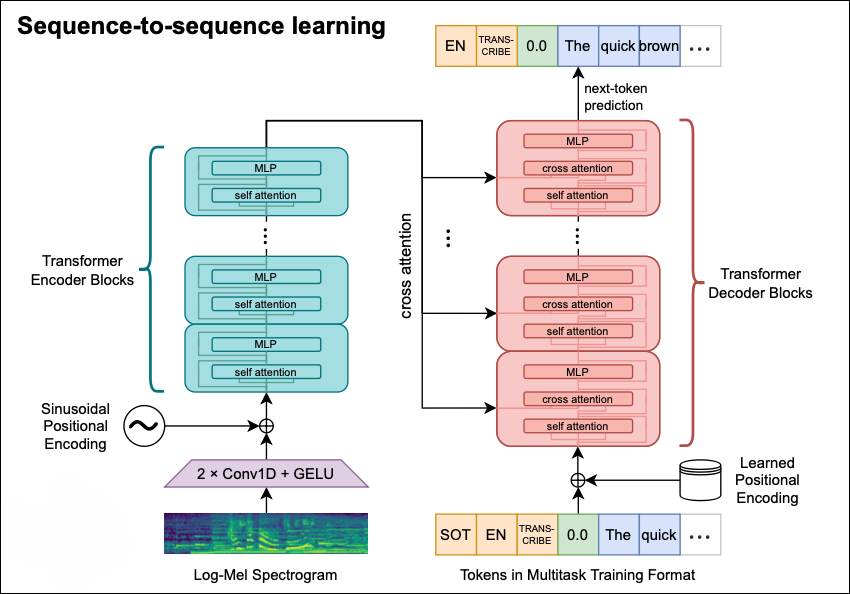
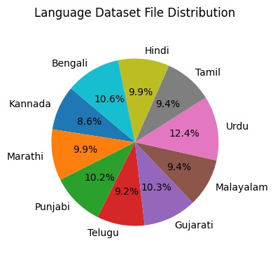
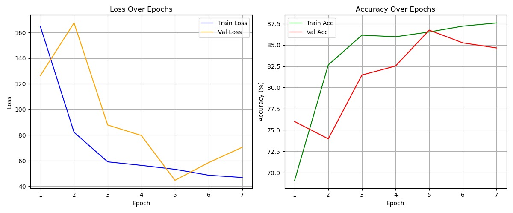

# Voice of Nation : Deeplearning for Indian Language Identification

## Introduction

India’s linguistic diversity poses a challenge for automated systems. This project aims to address the challenge by building a *deep learning model* capable of identifying 10 Indian languages from short audio clips. The system enables *accurate, real-time language-aware services*, contributing to advancements in multilingual technologies.

---

## Model Architecture

### HuBERT
*HuBERT* is a self-supervised speech model that learns hidden representations from unlabeled audio. It captures *phonetic and linguistic features* that can be fine-tuned for downstream tasks, including language identification.

  

### Whisper
*Whisper* is an end-to-end transformer-based model trained on *multilingual speech* datasets. It excels in *robust speech recognition* and *language identification*, even under diverse accents and noisy conditions.

  

---

## Dataset Structure

The dataset consists of audio files organized by language folders. Each folder represents a specific language and contains short audio clips (approximately 5 seconds each). Each audio file is *labeled* based on its folder to facilitate supervised learning.

  

---

## Key Features

- *Languages Covered*: Identification of 10 Indian languages.
- *Real-Time Processing*: Enables low-latency language identification suitable for real-world applications.
- *Robustness*: Handles diverse accents, noise conditions, and varied recording qualities.

---
## Evaluation and Results

### Loss and Accuracy:
#### HuBERT Model 

  

#### Whispher Model 

  

---

### Report 
Google Drive link: https://docs.google.com/document/d/1cvZUWDdH7ZLFiV2mt_L3zf-sO5SMQcu8jJeA0wXvIdE/edit?usp=sharing
